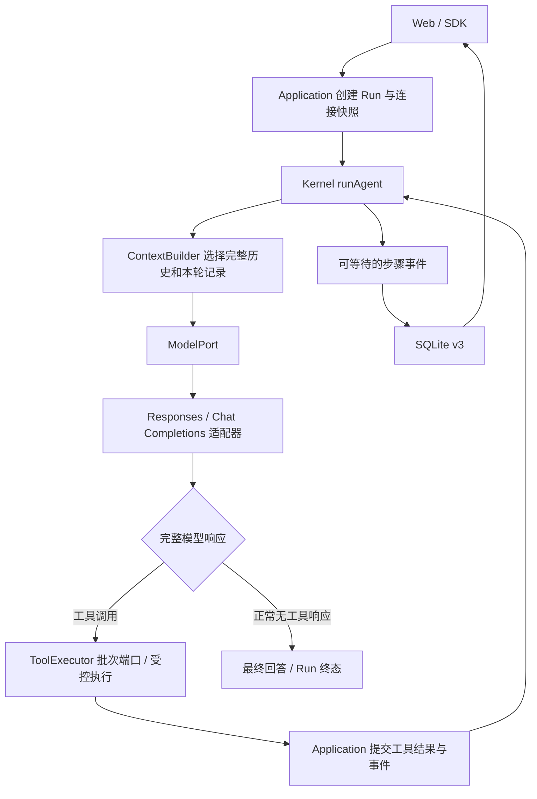

# 自主 Agent Loop

MyAgent 使用一个长期保持简单的循环：准备上下文 → 请求模型 → 执行工具 → 回传结果 → 继续或结束。模型自行决定是否使用工具、是否维护或调整计划；没有独立 Planner、强制反思、固定轮数或基于计划的调度器。

## 最小端口与模块关系

- `kernel` 定义 ModelPort、ContextBuilder、ToolExecutor，仅依赖 contracts；一次 Step 是一次模型调用和关联工具批次。无工具聊天与连接测试复用 runAgent，不存在第二套循环。
- `application` 创建 Run，冻结协议 / 地址 / 模型、配置与资源上限，读取完整历史，经可等待回调保存执行事实。状态不由 SDK 或上下文模块另存。
- `adapters` 实现双协议 SDK、SQLite 和最小本地工具；`apps/server` 是唯一装配点。
- `update_plan` 返回完整计划，计划由成功结果投影。工具本身不会派发任务、阻止其他操作或判定 Run 完成。
- `get_current_time` 使用真实系统时钟，默认 UTC，支持 IANA 时区。两个工具不写外部业务系统；完整执行治理仍未实现。

## 模型协议与上下文

Responses 使用 store:false、完整 input 与本地 Item 重放，不使用 previous_response_id 或 Conversations。Chat Completions 使用 assistant/tool 配对。两者都等完整响应后才执行工具，并关闭 SDK 自动重试。模型输出缺少结束事件、被截断或 ID 不完整时停止，不以半截参数执行工具。

厂商续接材料（Responses reasoning Item、Chat Completions reasoning_content 等）保存于服务端 StoredStep.continuation。identity 绑定协议、基础地址和模型；同连接成功历史保留完整步骤，跨连接仅传最终问答。新请求不向另一服务转发旧专有材料；公开 Step、SSE、Web 和普通日志均不含续接字段。

上下文通过异步 prepare 在模型请求前准备：历史事实保留，较早内容和本轮已完成批次按预算摘要化。软阈值优先保留最新工具观察，确实放不下时才摘要该批次；当前问题不静默删除。默认窗口 200000、输出预留 4096，估算与服务商实际 token 用量分开。工具预览默认最多 8000 字符，完整捕获有独立额度；决策、摘要与工具的累计产出只作统计，不因累计字符或总运行时间终止任务。见 [上下文管理](context-management.md)。

## 执行可靠性

调用先提交再执行，工具结果先提交再发下一次模型请求。模型文字约 250ms 合并写入，完整步骤与终态立即提交。存储失败不得继续外部执行。未知工具和无效参数反馈模型自行修正；网络、鉴权、协议和存储失败不自动重试。

单模型请求 120 秒、普通工具 30 秒、单命令进程默认 10 分钟；任务不限制总时长、累计产出或固定轮数。取消传至网络与执行器，即使实现忽略信号也可终结等待；迟到结果不能继续循环。页面断开不停止运行；重启只标 interrupted，不重放调用。

中间文字和工具属于 Step；最后无工具步骤是最终回答。重新生成另建候选，成功后才替换原答，失败不覆盖原计划。停止 / 删除并不意味着未来外部工具的副作用能撤销。Run.succeeded 只表示运行正常结束，不代表独立任务验收。

## 后续可替换点

上下文策略、工具注册与执行器均可独立扩展。MCP、审批、沙箱、并发调度已由 [工具执行系统](tool-execution.md) 实现；记忆、摘要和子 Agent 仍待设计。不要把已完成的执行层等同于完整 Agent 平台。
