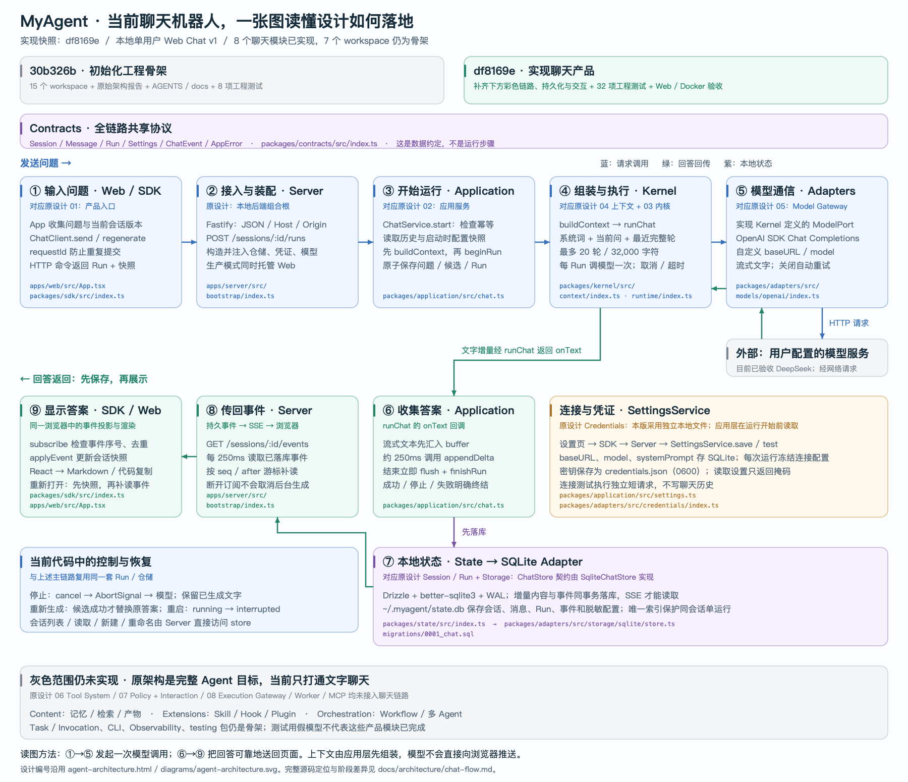

# 当前聊天链路：从设计到代码

实现快照：`df8169e`（本地 Web Chat v1）。本图根据当前源码核对调用顺序，原架构编号沿用 [设计报告](../../agent-architecture.html) 中的详细架构图。



[SVG 放大版](../../diagrams/chat-implementation-flow.svg) · [可编辑 Draw.io](../../diagrams/chat-implementation-flow.drawio) · [原设计总图](../../diagrams/agent-architecture.svg)

## 怎样读这张图

上排蓝线是发送问题：页面通过 SDK 提交问题，Server 检查请求并交给应用层。应用层读取历史和设置，调用上下文构建器，然后原子创建 Run，启动一次模型调用。原设计中的 Agent Runtime 在这里先落成一个零工具的 Chat Runtime。

下排绿线是回答返回：模型逐段返回文字，应用层把文字暂存，约每 250ms 写入数据库。内容与事件同事务保存后，Server 的 SSE 订阅每 250ms 读取事件，再由 SDK 去重并更新页面。这里有两个独立的 250ms 节拍，不承诺端到端刷新延迟精确为 250ms。

这解释了为什么刷新页面不会取消生成，也解释了为什么重新打开后能继续显示已保存内容。设置和凭证位于旁路，由应用层在创建运行时读取；模型服务在本地后端进程之外。Contracts 是共享数据定义，不是一个额外执行步骤。

## 原设计对应哪些文件

| 图中位置 | 原架构设计 | 当前实现与源码入口 |
| --- | --- | --- |
| ① / ⑨ Web + SDK | 01 产品入口 | [App.tsx](../../apps/web/src/App.tsx)：提交、会话切换、快照与消息展示；[SDK](../../packages/sdk/src/index.ts)：`ChatClient`、`subscribe`、`applyEvent` |
| ② / ⑧ Server | 后端组合根、命令接入与事件订阅 | [bootstrap/index.ts](../../apps/server/src/bootstrap/index.ts)：`buildServer` 装配，API / SSE / 静态托管；[schemas.ts](../../apps/server/src/routes/schemas.ts)：请求校验 |
| ③ / ⑥ Application | 02 应用服务 | [chat.ts](../../packages/application/src/chat.ts)：`ChatService.start`、缓冲提交、取消与删除协调；先检查幂等，再建立运行 |
| ④ Context Builder | 04 上下文构建 | [context/index.ts](../../packages/kernel/src/context/index.ts)：`buildContext` 保留系统提示、当前问题、最近完整成功问答；字符预算与裁剪提示 |
| ④ Chat Runtime | 03 唯一运行内核 | [runtime/index.ts](../../packages/kernel/src/runtime/index.ts)：`runChat` 消费一次模型流，负责取消、超时、完整结束与空响应判定 |
| ⑤ 模型适配器 | 05 Model Gateway | [ModelPort](../../packages/kernel/src/model/index.ts) 定义模型协议；[OpenAIChatModel](../../packages/adapters/src/models/openai/index.ts) 实现 Chat Completions 流、取消与错误转换 |
| ⑦ 状态与存储 | Session / Run、Storage Adapters | [State](../../packages/state/src/index.ts) 定义 `ChatStore` / `CredentialStore`；[SqliteChatStore](../../packages/adapters/src/storage/sqlite/store.ts) 实现事务与恢复；[初始迁移](../../migrations/0001_chat.sql) 定义表和索引 |
| 设置与凭证旁路 | Credentials + Identity 中的本地凭证部分 | [SettingsService](../../packages/application/src/settings.ts)：配置、快照与连接测试；[FileCredentialStore](../../packages/adapters/src/credentials/index.ts)：受限文件与原子替换。未实现 OIDC 或系统钥匙串 |
| 顶部 Contracts | 跨模块消息与事件协议 | [contracts/index.ts](../../packages/contracts/src/index.ts)：DTO、状态、错误、限制和事件定义 |
| 底部扩展区 | 工具、权限、执行、内容、扩展与编排 | 仍是骨架，具体范围见 [模块关系](modules.md)；不参与本次模型运行 |

这里的 Model Gateway 只实现统一流接口与一个适配器，没有模型路由、能力目录或成本系统；Context Builder 没有检索或自动摘要；Chat Runtime 没有“模型 → 工具 → 模型”的循环。

## 与两个提交的关系

- [30b326b：工程初始化](https://github.com/baixiaonian/myagent/commit/30b326b1b912af879d7897c24cf6df6a1795d877) 创建 15 个 workspace、工具链、占位入口、AGENTS 与知识库；库包尚无业务实现。
- [df8169e：聊天产品](https://github.com/baixiaonian/myagent/commit/df8169ea585c13bd9b3c285acb96f108cfad2bf4) 将上述 8 个模块连通，补上设置、持久化、恢复、安全与界面能力，并加入测试和交付配置。
- [查看两个阶段的代码差异](https://github.com/baixiaonian/myagent/compare/30b326b1b912af879d7897c24cf6df6a1795d877...df8169ea585c13bd9b3c285acb96f108cfad2bf4)。本地使用 `git diff 30b326b df8169e -- apps packages migrations tests`，可以只阅读产品实现的变化。

图中的 8 项 / 32 项测试属于上述提交的已记录验证，不表示本轮又运行了真实模型或容器验收。证据见 [提交整理](../history/2026-09-08-commit-history-split.md) 与 [真实模型 / Docker 验收](../history/2026-09-08-live-model-and-docker-acceptance.md)。

## 读代码时需要注意的细节

- `buildContext` 由 `ChatService.start` 在 `beginRun` 之前调用；`runChat` 不负责查询数据库。
- 幂等检查首先发生在应用层；活动运行、会话版本和原子写入由 `beginRun` 事务保证，数据库唯一索引兜底。
- 当前 Server 对会话列表、快照、新建、重命名直接调用注入的 store；生成、取消和删除经过 ChatService。图中对这一实际实现作了说明，未将它画成所有 API 都必须调用应用服务。
- 停止传播到模型请求并保存部分内容；重新生成只有候选成功才替换原答案；服务启动将未完成运行标为 `interrupted`，不会自动再次调用模型。

## 重建图表

[build_chat_flow.py](../../scripts/build_chat_flow.py) 从同一份布局生成 SVG 和 Draw.io，不读取用户模型设置或上游研究快照：

```sh
python3 scripts/build_chat_flow.py
# macOS 原生导出 PNG；其他平台可从 SVG / Draw.io 导出同名 PNG。
sips -s format png diagrams/chat-implementation-flow.svg --out diagrams/chat-implementation-flow.png
```

变更后检查箭头方向、文本是否越界、源码路径是否存在及设计 / 实现状态是否一致；同步本页与当前状态。原设计报告和原总图保持历史基线。
