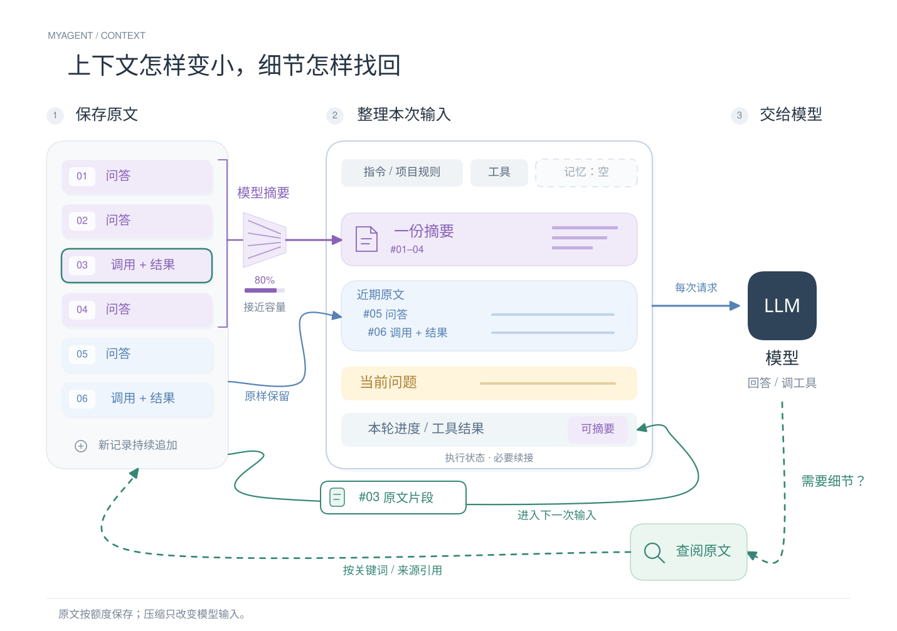

# 上下文管理

本模块管理每次模型请求的输入视图，原始消息、Step 和工具执行记录仍归现有仓储。摘要不会删除或覆盖原记录，也不是长期记忆或执行授权。

## 原理图

[查看矢量图](../../diagrams/context-management.svg) · [可编辑 Excalidraw](../../diagrams/context-management.excalidraw) · [图源及重建说明](../../diagrams/README.md)

图以消息卡片示意原文与输入的关系：左侧 #01–04 保留原文，中间变成一张摘要；#05–06 原样选入。底部绿色回路只取回 #03 的命中片段，进入下一次模型请求。编号和块数是示意，不代表固定裁剪轮数；本轮完整步骤也可压缩，当前问题始终保留原文。

## 调用关系

Web → SDK → ChatService → runAgent → 异步 ContextBuilder.prepare → ContextService → ModelPort。

Loop 在完整工具批次落库后保存检查点，再等待上下文准备。ContextService 选择完整记录并提交请求清单；ContextSummarizer 只发起无工具的摘要请求，不运行另一套 Agent Loop。原生执行、命令规则、资源审批不因摘要而改变。

## 输入与容量

Run 开始时冻结连接、容量和项目根 AGENTS.md；文件最多 64 KiB，越界链接、非法编码、读取变化和权限错误明确拒绝。规则缺失允许继续，不向父目录搜索。MemoryProvider 返回带来源的只读片段，当前由 MemoryService 注入有界长期记忆概览；详见 [长期记忆架构](memory.md)。

每次请求按当前有效目录加载完整工具定义。固定指令、根规则、记忆资料、执行事实索引、历史摘要、保留原文和当前问题一起计入容量。摘要、记忆和工具输出都是有来源的资料，不能授予执行权限。

固定指令与动态观察分离：执行索引首次发送完整快照，变化后在已完成批次之后追加增量，正文/锚点持久保存。同一状态不重复追加，不每步改写 system。增量基线被摘要覆盖后补最新完整状态；压缩仍按容量触发。双协议工具定义确定性排序，已缩减预览按来源保留上限，详见 [缓存前缀决策](../adr/0019-cache-stable-context.md)。

默认窗口 200000、输出预留 4096，安全余量为 max(1024, 窗口×15%)。剩余输入预算的 80% 触发压缩，目标 60%；摘要最多 2048 估算 token，小窗口进一步缩小。双协议适配器复用实际请求序列化，用 UTF-8 字节数/3 向上取整估算，Responses 不重复计入展示正文。估算不是 tokenizer 或计费承诺，输出预留不是服务商输出限制。

## 选择和摘要

较早历史优先压缩，最近 3 轮只是原文保留偏好。软阈值下优先保留本轮最新完整工具批次；只有确实放不下时才压缩最新观察，避免过早丢失直接观察而诱发重复查询。完整模型响应及其配对工具结果是最小替换块：单轮任务的早期步骤和最新完整批次都可摘要化。当前问题、必要指令和工具 Schema 不静默删改。

大工具结果先保留有界首尾、执行状态和原文引用；8000 字符是单条上限，包含 JSON 包装、转义、截断提示和引用，不是保证分配的额度。仍放不下时尝试 512 字符预览，再压缩完整块。每次缩减通过受会话约束的 ResultStorePort.preview 从已保存原文重建；没有文件的旧记录使用本次准备开始前的原消息，不改写历史。固定事实与引用无法容纳时明确暂停。仅必要内容就超限则暂停，提示调整容量或直接工具定义，不能靠摘要修复。

摘要按语义正文分块，超大单条也可分段；按“已有摘要＋下一块”合并。厂商私有 reasoning/续接 Item 不进入语义摘要。每个付费请求记录状态和 usage，已完成分块草稿可供明确恢复复用；失败不会自动重试。模板版本、来源指纹、连接身份和规则版本共同控制复用。

摘要完整生成后先成为候选；选入检查点、发布标志、请求清单和事件在同一事务启用。取消、删除和 generation 改变后拒绝迟到结果。重新生成按独立候选分支处理，失败不覆盖原回答的摘要；跨连接只按原规则读取最终问答，不发送旧私有续接。

## 保存与查阅

SQLite v6 的 context_records 保存规则/工具来源快照、摘要、任务、Run 上下文和请求清单。消息、工具结果及私有续接保留原归属。请求清单保存来源、摘要、投影记录、消息哈希和估算，不复制整份历史正文。

read_conversation_history 与历史 API 共用白名单投影，可按普通文本、来源 ID、游标查询。仅当前会话；最多 20 条/8000 字符，长单条可续读。失败或被替换分支可显式查阅，分支状态与单个工具状态分别保留。大型结果用 read_tool_result；页面和模型查询均无厂商私有续接和凭证字段。

执行事实索引由数据库聚合并限制明细数量，不把所有旧副作用塞入提示词。未知结果的实际隔离依然由执行仓储判断。结果保存仍受单条 20 MiB、每 Run 100 MiB 限制，captureComplete 与模型预览截断是不同概念；未采集总量未知时 omittedBytes=null。

## 失败和恢复

摘要失败而原文可容纳时继续并提示，同 Run 暂停自动重试；超限进入 waiting_context。用户可重试整理或明确应用最新容量，恢复不换原连接、规则和协议。服务商明确的 context_length_exceeded 等错误进入同一暂停流程，不自动重发业务请求。

重启中断未完成摘要任务，保留上次有效检查点，不自动付费。摘要消耗计入统计和实际用量，但不受任务累计产出或总时长配额约束；单次摘要请求超时、单份摘要及输入预算仍生效。暂停不表示活动进程停止，原执行维护和未知结果处理继续生效。

接口见 [上下文 v6](../protocols/context-v6.md)，使用见 [维护说明](../development/context.md)，决策见 [ADR-0010](../adr/0010-context-management.md)。

摘要在模型输入中作为带来源的 user 背景资料，明确声明不是新指令或授权；不伪造 assistant 输出或厂商推理字段。这兼容要求助手输出携带原生推理材料的 Responses 服务。

摘要写作目标和发布上限分离，完整且有压缩效果的稍长摘要可以使用弹性空间；不在目标边缘中断流。终态 usage 与候选发布分离，拒绝候选也保留已知费用用量。算法和边界见 [上下文协议](../protocols/context-v6.md#摘要弹性预算与完整用量)。
