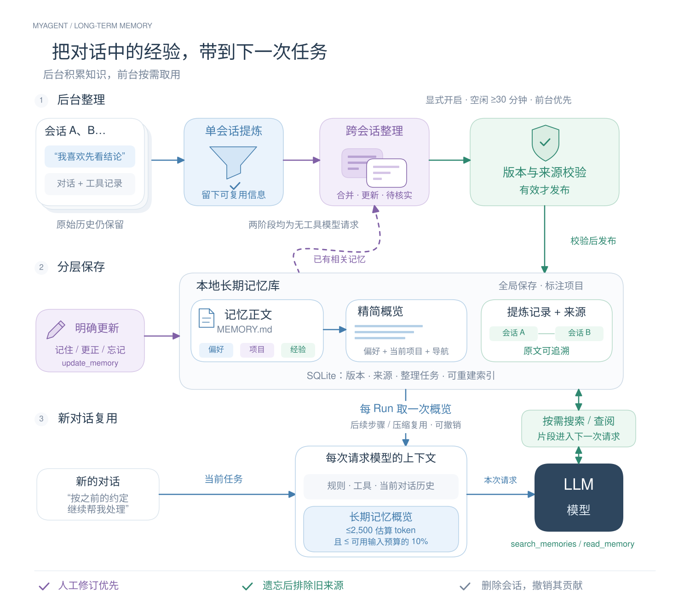

# 长期记忆 v1

在已有原始历史、会话摘要之上提供跨会话知识。不开第二套 Agent Loop，不维护独立的会话笔记。默认关闭，启用后后台自动提炼；人工编辑和对话明确更新走同一发布服务。

[可编辑图源与源码对照](../../diagrams/README.md#长期记忆实现原理图)。蓝色为概览注入，绿色为模型按需查阅，紫色为已有知识合并及用户明确更新。

## 职责与入口

- `content/memory.ts`：条目校验、已知敏感形态脱敏和完整条目预算选择，无文件/数据库依赖。
- `application/memory.ts`：MemoryService 管理页面、对话更新、来源撤销、文件发布与每 Run 读取；`memory-jobs.ts` 独立调度两次或多次无工具模型请求。
- `state/memory.ts`：文件端口、任务与派生索引类型；`adapters/memory/files.ts`：Markdown 解析与原子写入；`storage/sqlite/memory.ts`：v7 类型化记录仓储。
- `server/bootstrap` 唯一装配；现有维护周期刷新文件，后台候选扫描每分钟一次。`routes/memory.ts` 提供独立 HTTP 查询，SDK 和 MemoryDialog 不依赖聊天 SSE。

## 生成与发布

开启时间保存为首次水位，自动候选只采用此后创建的 Run。会话没有活动 Run、允许贡献且闲置默认 30 分钟才进入候选；每批最多 3 个，全局同时只整理 1 个。前台活动时不启动模型请求，已在途请求正常收尾，在下一请求边界让出。

第一阶段读取有效分支的用户消息、Step 和安全工具投影；失败状态保留，被替换候选剔除，不把会话摘要当作唯一事实。来源由程序计算 ID/内容哈希，不接受模型制造身份。长记录采用有截断说明的首尾预览，按完整记录分块。每块最多提炼 3 条，允许空数组。

第二阶段按标题字符二元组检索相关条目，每批最多 5 个候选、最多 8 条相关记忆；必要时缩小批次直到实际协议估算满足预算。模型提出新增、合并、替换、跳过或待核实；应用验证候选索引、目标身份、正文长度、来源和版本。人工条目不可自动覆盖，冲突条目不注入模型，可在管理页查阅和人工修订。

每次整理请求最多使用 16000 估算输入 token，并受连接可用输入预算约束；输出最多 32000 字符。任务默认最多 8 次、每天 UTC 最多 32 次，发出前事务预占次数。每次请求记录阶段、终态和真实 usage，缺失用量为未知。任务启动冻结连接、协议和容量；重试只允许显式扩充调用预算，不悄悄换连接。

正文以 `memories/MEMORY.md` 为准。条目由固定 Markdown 标记和 JSON 元数据包围；概览为派生文件，提炼记录位于 `rollout_summaries/`。SQLite 保存索引、任务、文件提交日志、来源、使用排序、操作幂等和删除标记。文件限制 4 MiB，条目正文最大 12000 字符。

发布顺序：保存提交意图和旧正文 → 校验文件哈希 → 临时文件 fsync + 原子 rename → 更新概览与提炼产物 → 再次核对来源 → 同事务切换索引与有效版本。发布期间的读者经过同一串行门；崩溃后依提交日志补齐，不重发模型请求。发布期间取消会回滚未启用的候选，外部修改冲突时停止覆盖并报告。任意外部编辑器不参与文件锁，哈希/rename 不声称跨进程强事务。

## 读取、快照与变更

每个 Run 首次构建上下文读取一次概览，预算取 `min(2500, 可用输入预算 × 10%)`。通用偏好优先，再取本项目知识，其他项目提供导航；按完整条目或完整标题选择，长正文留给分页。所有输入计入既有容量统计。后续 Step 和压缩继续复用原快照，普通新条目下一 Run 生效；禁用、删除和明确更正在下次准备时撤销旧片段。

`search_memories` 支持中文子串、多关键词、项目和类型过滤；`read_memory` 读取正文、返回的来源 ID 与提炼产物投影。单响应最多 20 项/8000 字符，正文与来源均可续读。不能传任意磁盘路径、任意会话 ID，厂商续接、凭证和后台输入不进入公开返回。

`update_memory` 仅用于用户明确要求记住、更正、忘记；描述要求歧义先查阅并澄清，服务端绑定活动 Run、调用记录、参数版本并通过调用身份幂等。这里不声称自然语言意图可由规则完美识别。独立新增保存为人工记忆；更正/删除须指定准确条目和版本，不支持模糊批量操作。

遗忘保存最小来源排除标记，防止旧材料重新生成。删除会话先撤销来源与在途任务，再删除对应提炼记录；混合来源条目先标记待核实并停止提供，余下会话进入重建队列。人工独立条目不随会话删除。历史消息及已经发给模型的内容不被改写。

## 边界

这是可信本机单用户的记忆库；不是知识库、向量检索、团队共享或自动 Skill 系统。密钥通过现有凭证服务使用；已知敏感形态脱敏不是通用秘密识别保证。模型提炼可能遗漏或误判，来源与版本让用户可核对、修订、撤销。操作与验收见 [使用说明](../development/memory.md)、[v7 协议](../protocols/memory-v7.md) 和 [本轮记录](../history/2026-09-26-long-term-memory.md)。
