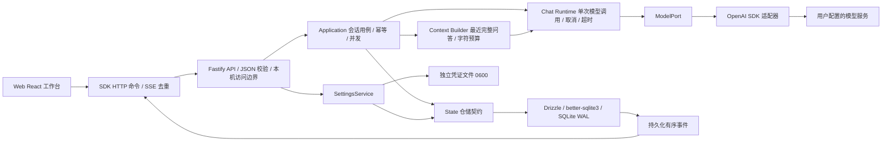

# 当前架构

MyAgent 采用模块化单体。本地服务器统一托管 Web 和 API，SQLite 与凭证文件在用户数据目录，模型服务由用户配置。浏览器不持有已保存密钥。

`apps/server` 是组合根，注入仓储、凭证和模型工厂。单实例锁保存于数据目录内的 `server.lock`，允许数据卷父目录只读；启动同时检查旧版本目录旁锁，升级前先停旧服务。`application` 不依赖数据库驱动或厂商 SDK，`kernel` 仅依赖 contracts 与自定义 ModelPort。`sdk` 不拥有服务端状态，Web 只通过 SDK 访问服务。

## 关键不变量

- 用户问题、候选回答、Run 与开始事件在同一事务内提交；每个会话最多一个 running Run，SQLite 部分唯一索引兜底。开始 / 终结 / 重命名递增会话 revision。
- 请求携带 requestId 和 expectedRevision。相同标识、相同负载返回原 Run；相同标识不同负载返回冲突。不会因网络重发创建第二次模型调用。
- 增量约每 250ms 先落库再暴露事件；终止立即提交。事件 seq 按会话单调递增。快照和游标同事务读取，重连从游标补读，SDK 对重复序号去重。
- 停止传播 AbortSignal，并保留部分回答。页面断开不等于停止。重启将遗留运行标记 interrupted，不自动恢复模型调用。
- 重新生成保留原完整答案，另建候选；仅在成功终结事务中替换。失败 / 停止候选留存但原答案继续展示。
- 删除活动会话先取消再级联删除。仓储拒绝给已删除 / 已结束 Run 追加迟到结果。
- 设置变更采用 revision，密钥先写新引用再提交配置，成功后清理旧引用。运行创建独立模型实例，使用不可变连接快照。密钥只在独立受限文件中；明文不落入数据库、错误响应或日志。

## 尚未实现的扩展

工具、权限执行、Task 验收、Skill / Hook、内容检索、Workflow、Worker 和多 Agent 仍为骨架。没有第二套循环或模拟实现。当前内核每个 Run 严格调用模型一次，未来扩展须保持现有取消、幂等和状态语义。详细 [模块关系](modules.md) 与 [ADR-0003](../adr/0003-local-web-chat.md)。
