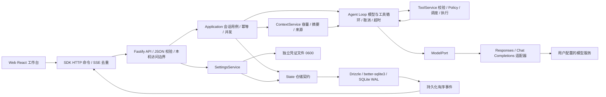

# 当前架构

当前完整执行链见 [工具执行系统](tool-execution.md)，以下保留统一循环及会话层关系。

MyAgent 采用模块化单体。本地服务器统一托管 Web 和 API，SQLite v13 与凭证文件在用户数据目录，模型服务由用户配置。浏览器不持有已保存密钥。

历史 [Chat v1 链路与代码提交对应关系](chat-flow.md) 保留请求、落库和 SSE 的阶段设计；当前新增步骤、工具与双协议的执行链见 [自主循环](agent-loop.md)。

`apps/server` 是组合根，注入仓储、凭证和模型工厂。单实例锁保存于数据目录内的 `server.lock`，允许数据卷父目录只读；启动同时检查旧版本目录旁锁，升级前先停旧服务。`application` 不依赖数据库驱动或厂商 SDK，`kernel` 仅依赖 contracts 与自定义 ModelPort。`sdk` 不拥有服务端状态，Web 只通过 SDK 访问服务。

## 关键不变量

- 用户问题、候选回答、Run 与开始事件在同一事务内提交；每个会话最多一个活动 Run（含审批、核对与恢复等待），SQLite 部分唯一索引兜底。开始 / 终结 / 重命名递增会话 revision。
- 请求携带 requestId 和 expectedRevision。相同标识、相同负载返回原 Run；相同标识不同负载返回冲突。不会因网络重发创建第二次模型调用。
- 增量约每 250ms 先落库再暴露事件；终止立即提交。事件 seq 按会话单调递增。快照和游标同事务读取，重连从游标补读，SDK 对重复序号去重。
- 停止传播 AbortSignal，并保留部分回答。页面断开不等于停止。重启有检查点的运行先核对回执，再等待手动继续；旧版本无检查点的运行标记 interrupted，不自动调用模型或工具。
- 重新生成保留原完整答案，另建候选；仅在成功终结事务中替换。失败 / 停止候选留存但原答案继续展示。
- 删除活动会话先取消再级联删除。仓储拒绝给已删除 / 已结束 Run 追加迟到结果。
- 设置变更采用 revision，密钥先写新引用再提交配置，成功后清理旧引用。运行创建独立模型实例，使用不可变连接快照。密钥只在独立受限文件中；明文不落入数据库、错误响应或日志。

## 最小扩展与后续边界

工具调用与结果保存为 Step，续接材料只在服务端读取，公开 SSE 不携带它们。计划作为普通工具结果，不触发任务调度。默认单次模型请求 120 秒、普通工具 30 秒、单命令进程 10 分钟，可配置；任务无累计产出上限、总时限或固定轮数。

原生权限执行、审批、MCP、Worker 和检查点恢复已接通；轻量多 Agent 已接通，Task 验收、知识库检索、Workflow 和外部 A2A 仍为骨架。详细见 [模块关系](modules.md)、[ADR-0004](../adr/0004-autonomous-agent-loop.md)。

项目入口和 MCP 管理采用 [项目与 MCP 架构](projects-mcp.md)：新对话选目录、每会话默认目录、双作用域配置文件和真实运行时状态。执行循环与治理边界不变。

命令启动还叠加 [命令级权限](../protocols/commands-v5.md)：静态读取自动，其他默认询问，用户/项目规则取最严格结果，批准绑定本次调用。资源策略与原生沙箱继续独立执行；Loop 不负责判断命令风险。

上下文通过异步端口在完整工具批次后准备；历史不被摘要覆盖，单轮也可压缩，失败可暂停恢复。见 [上下文管理](context-management.md)。

长期记忆是 application 的独立后台维护服务：以有效历史提炼候选，有界合并后通过日志发布到 Markdown，content 提供概览和读取端口。前台仍只有一个自主 Loop。见 [记忆架构](memory.md)。

Skill 通过目录提示和普通加载工具进入同一循环，完整正文由上下文服务在当前 Run 保留。详见 [Skill v1](skills.md)。

轻量团队通过普通协作工具使用持久收件箱与独立成员会话，复用同一循环。主 Agent 可以执行任务；内核通用完成确认保证成员收拢后交付。见 [团队架构](teams.md)。

执行权限现支持标准/完全访问双模式；两者复用同一 Loop 和执行生命周期，区别在用户选择的命令/资源策略与 Worker 沙箱。详见 [执行模式 v13](../protocols/execution-mode-v13.md)。
