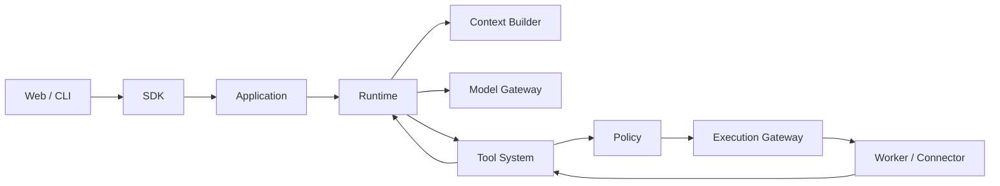

# 架构概览

架构基线：模块化单体 + 稳定运行内核 + 可替换适配器。当前仅建立工程边界。

## 主链路

Context 生成资料快照，由 Runtime 交给 Model Gateway。模型返回完整工具请求时才进入工具系统；每次工具结算后重新组装下一步上下文。事件记录事实和 UI 更新，不用事件监听器隐式驱动另一套循环。

`apps/server` 是唯一后端装配点；应用、内核、状态、内容和扩展管理起初共进程。Worker 的独立进程提供执行边界，实际安全隔离仍需容器或 OS 能力。

## 状态所有权

| 对象 | 所有者 | 语义 |
| --- | --- | --- |
| Session / Branch | state/session | 对话历史和分支，不负责撤销外部动作 |
| Task / Plan | state/task | 目标、约束、计划、验收，可跨多个 Run |
| Run / Step | kernel/runtime 推进，state/run 持久化 | 一次执行 / 一次模型调用及其工具批次 |
| Invocation | state/invocation | 工具意图、派发阶段、执行回执 |
| Memory / Source | content | 带来源、作用域和版本的长期内容 |
| Artifact / Revision | content/artifacts | 产物、文件引用、版本与验收记录 |

## 必须保留的语义

1. 每个 Session 的当前主分支单写者，状态和关键事件同事务提交。
2. 每步冻结模型配置、工具目录与上下文视图；Hook 修改参数后再校验并做最终权限决策。
3. 外部副作用采用 intent / dispatching / settled 记录；结果未知先查询回执或人工核对，不直接重复写入。
4. cancel 停止派发并收拢已开始动作，不能把取消当作副作用回滚。
5. Skill 是按需读取的说明书；Hook 是生命周期扩展；Plugin 管理注册与资源回收。脚本都进入执行治理。
6. Workflow 执行固定依赖图，Runtime 动态推进模型步骤。编排通过 RunCommandPort 调用应用实现。
7. 子 Agent 有独立 Session、预算和权限上限，结果通过摘要和产物引用汇总。

## 配置与凭证

未来配置合并顺序：默认 → 部署 profile → 用户 → 项目 → 本次 Run 的允许覆盖项。安全权限取上限交集；项目不能扩大部署侧授权。Run 保存配置摘要，凭证只保存引用。当前没有配置加载器。

## 详细设计

[模块表](modules.md)、[技术选型](technology.md)、[协议规划](../protocols/README.md)、[原始 HTML](../../agent-architecture.html)、[详细 SVG](../../diagrams/agent-architecture.svg)。
