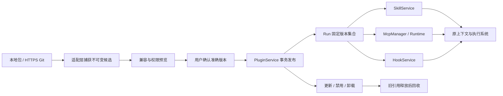

# 插件架构

[配置到生效链路图](../../diagrams/plugin-activation.png) · [SVG](../../diagrams/plugin-activation.svg) · [可编辑图源](../../diagrams/plugin-activation.drawio)：包含实际服务入口、Run 版本冻结及外部 Hook 未适配的当前边界。

[查看完整原理图](../../diagrams/plugins.png) · [可编辑 Draw.io](../../diagrams/plugins.drawio) · [图源与源码对应](../../diagrams/README.md)

图中已展开 PluginService、SkillService / ContextService、MCP Runtime 和 HookService 的接入位置；安装不执行脚本，标准模式的沙箱与 Hook 独立授权边界见 [图表更新记录](../history/2026-10-01-plugin-support-diagram.md)。

插件解决“一组配套能力如何一起交付和管理”。例如报告助手提供报告 Skill、样例销售 MCP 和路径检查 Hook。模型仍通过普通工具循环加载技能、查询数据、写报告；插件本身不调度步骤。

- `extensions/plugins.ts` 解析清单、报告兼容性并定义来源端口；不运行代码。
- `application/plugins.ts` 负责管理任务、版本确认、作用域覆盖、Run 引用和回收。
- `adapters/plugins/files.ts` 负责本地/Git 获取、文件验证、不可变包与只读副本；复用 LocalPackageFiles。
- `state/plugins.ts` 和 SQLite 仓储保存管理事实；Server 装配三类提供者。SDK/Web 只调用管理 API。

安装确认一次提交有效组件集合。MCP 真实握手失败只影响可用状态，不伪装成安装失败或已连接。安装阶段不会执行入口；确认启用后才允许握手/工具发现，业务调用仍走资源审批。Hook 只获得展示并确认的权限，不能继承模型命令授权。

包更新、启停和卸载只改变新 Run；旧 Run 的 MCP 连接和工具目录也固定版本，不能只固定磁盘文件。连接身份包括工作区，因此不同项目不共享错误的目录投影。资源/凭证撤销优先于版本固定。

协议见 [v10](../protocols/plugins-v10.md)，操作见 [使用维护](../development/plugins.md)。
