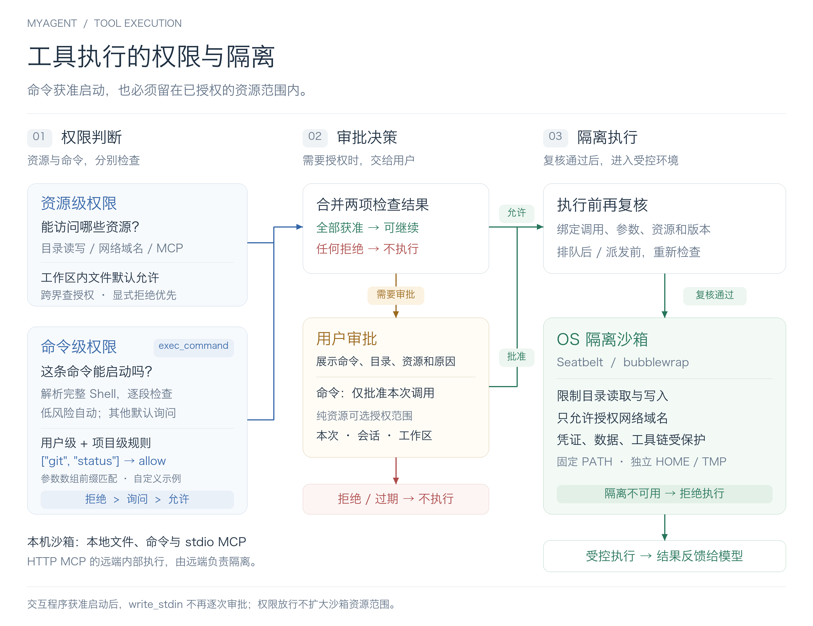
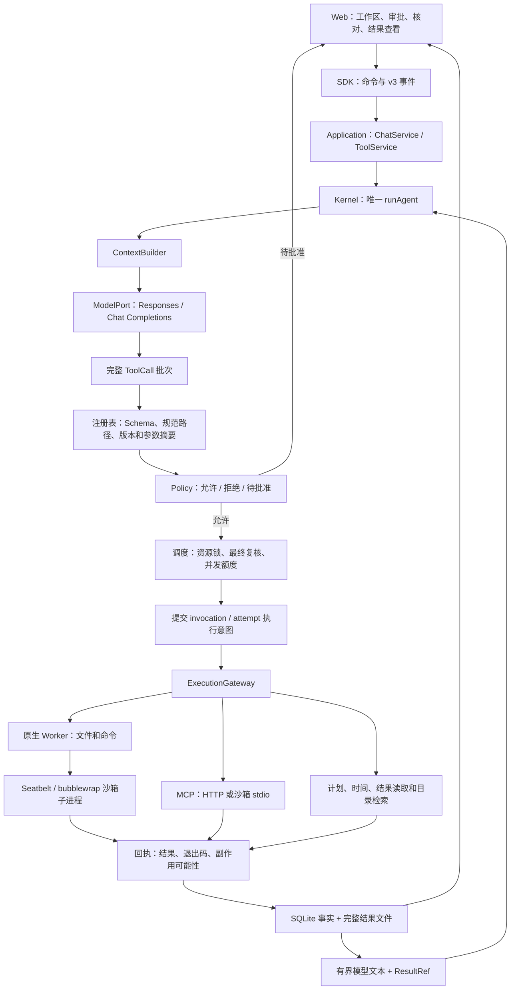
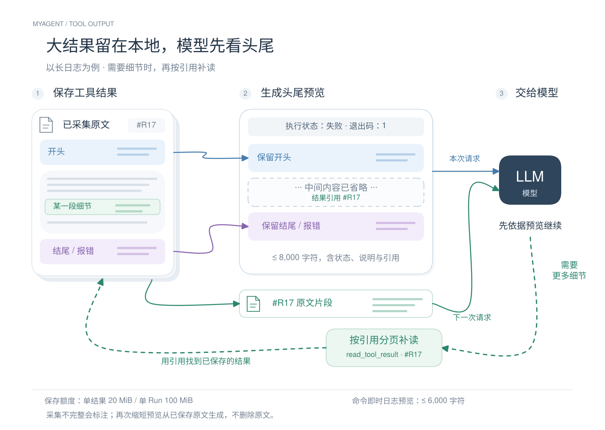

# 工具执行系统

权限模式补充：本文中的命令规则、审批与沙箱保证适用于默认**标准权限**。用户可在输入框旁选择**完全访问**，新 Run 与成员免命令/资源审批并采用无沙箱工具进程；停止、超时、版本和未知结果校验仍保留。Hook 继续使用独立授权。详见 [执行模式 v13](../protocols/execution-mode-v13.md)。

MyAgent 保持一个自主循环。模型决定要做什么，工具系统负责确认指令完整、权限足够、资源不冲突，然后执行真实动作，并把可靠结果交回原调用 ID。框架不把计划变成固定步骤，也不增加评价模型。

## 权限与隔离图

[可编辑 Draw.io](../../diagrams/tool-permissions.drawio) · [矢量 SVG](../../diagrams/tool-permissions.svg)。命令检查仅针对 `exec_command` 启动；其他工具仍经过适用的资源策略。图中的 `git status` 放行是自定义规则示例，不代表默认放行。

图由 [生成器](../../scripts/build_tool_permissions.py) 统一生成三种格式；重建需要 Pillow 和中文字体，运行 `python3 scripts/build_tool_permissions.py`，也可通过 `--font` 指定字体。此次图表验证见 [迭代记录](../history/2026-09-22-tool-permissions-diagram.md)。

## 完整执行链路

## 模块怎么分工

- `kernel/runtime` 只构建上下文、请求模型、调用批次端口并反馈结果。普通聊天走同一个循环。`kernel/tools` 放纯协议、Policy 判断、调度与资源锁，不导入数据库、文件系统或厂商 SDK。
- `application/tools.ts` 是执行用例：准备、审批、派发意图、结果保存、未知结果隔离及恢复核对。`chat.ts` 管理运行总生命周期和检查点，不实际读写目标文件。
- `adapters/execution/registry.ts` 维护定义和 Ajv 最终校验，计算规范资源和锁。新增工具要注册定义并提供可信执行适配，不需要改 Loop。
- `adapters/execution/gateway.ts` 管理 Worker；`worker-runtime.ts` 监督进程和持久回执；`files.ts` 在沙箱子进程中执行文件操作。
- `adapters/mcp` 负责官方 SDK 双传输、目录刷新、OAuth 和网络边界。远端 `annotations` 只是提示，不授予权限。HTTP MCP 的远端内部执行不受本机 OS 沙箱限制，本机控制连接、批准范围、取消信号及结果边界。
- `state/execution.ts` 定义仓储；`adapters/storage/sqlite/execution.ts` 与聊天仓储共享数据库事务。Web 不拥有第二套状态机。
- `apps/server` 是唯一装配点。`apps/worker` 是 IPC 执行入口，不运行模型，不启动 HTTP 服务，不访问主凭证库。

## 八个核心问题的落点

| 问题 | 当前实现 |
| --- | --- |
| 有哪些动作 | 13 个核心工具，以及按需检索的 MCP 函数工具 |
| 如何注册与发现 | 本地固定注册；MCP 连接后抓取目录，服务默认由 `search_tools` 按需加载，也可设为 direct 每次直接提供全部定义 |
| 能不能执行 | 工作区、规范路径、最终 Schema、定义版本、allow/deny/ask、原生沙箱 |
| 多个动作怎么安排 | 每 Run 4、全局 8；共享段有界并行、排他屏障、路径层级锁、MCP 连接独占 |
| 如何停止 | AbortSignal、真实进程组终止、退出确认；不能确认时保留 unknown |
| 如何处理副作用 | 调用与尝试身份分离；先保存意图；不自动重试；未知资源隔离；重跑需确认 |
| 如何反馈大结果 | 完整文件、受会话约束的 ResultRef、8,000 字符预览、分页及明确截断说明 |
| 如何排障与恢复 | v3 持久事实和事件、Worker 回执、检查点、重启核对后手动继续 |

## 工具与权限

核心工具：`update_plan`、`get_current_time`、`list_directory`、`search_files`、`read_file`、`write_file`、`edit_file`、`exec_command`、`read_process`、`write_stdin`、`stop_process`、`read_tool_result`、`search_tools`。

新对话可以直接选择已存在目录，不选时自动分配独立默认目录；首次发送时完成绑定，之后更换目录需要新建会话。保存规范路径和目录身份；路径穿越、符号链接或目录替换都需要重新核验。应用安装目录和数据目录受保护，不能作为普通读写工作区。目录内可自主读写；命令启动还经过独立命令策略，明确低风险自动，其他默认询问。跨目录、额外网络和 MCP 未分类动作进入审批；拒绝规则优先。

纯资源批准支持本次、当前会话、工作区长期授权；含命令的批准仅本次，长期放行通过用户/项目命令规则设置。单次批准绑定 invocation、最终参数摘要和资源；审批后、拿锁后都复核。MCP 工具定义版本变化后旧允许授权不再匹配。长期授权可以撤销；撤销关闭涉及工作区的执行 Worker/MCP 连接，在途远端副作用仍可能已经发生。重启撤销单次与会话授权，保留工作区授权。待批准请求 24 小时过期。审批和权限是执行约束，不能由模型文字修改。

写文件采用读取哈希、唯一文本匹配、同目录临时文件、fsync 和原子替换。为保证临时文件可写，写操作请求目标父目录的权限。模型或另一个 MyAgent 调用不能覆盖过期版本。外部编辑器不遵循本进程资源锁，哈希复查到 rename 之间仍有 OS 竞态窗口；不承诺任意外部进程下的强事务，也不把多文件编辑当成事务。

## 调度与真实进程

同一步多调用先整体准备，再按模型顺序分段。共享工具可以并行，但写锁仍互斥；目录写锁覆盖子路径，多个锁原子获取，等待可取消。命令持有工作区写锁直到真实退出，后续通过进程控制工具读输出、输入或停止。未分类 MCP 工具按连接独占。返回模型的结果始终按原调用顺序与 ID 配对，不按完成先后顺序拼接。

`exec_command` 使用非登录 Shell、管道 stdin/stdout/stderr，无 PTY。短暂等待后可以返回进程 ID，供同 Run 后续读取和控制；Run 结束或停止时清理。默认普通工具请求 30 秒、模型请求 120 秒，单命令进程默认 10 分钟。命令可给出 timeoutMs；未指定时使用 MYAGENT_COMMAND_TIMEOUT_MS。任务本身没有总时限和累计产出上限，连续多个调用不会因累计达到 10 分钟终止。等待人类审批不计入活动时间统计；若仍有真实命令运行，继续统计且进程自身超时仍生效。

Worker 权限在初始化时固定。每个 Worker 有独立原生沙箱管理器与代理，主服务不把模型凭证和完整环境交给它。macOS 使用 Seatbelt；Linux 使用 bubblewrap。先做实际功能探测，失败就返回 `sandbox_unavailable`，没有裸执行降级。

本轮命令网络授权仅支持具体公网域名，拒绝通配符、本机地址与回环解析，防止命令调用 MyAgent 本地管理 API 修改自己的授权。HTTP MCP 可由用户配置精确本机服务地址；OAuth 元数据不能将请求重定向到未配置的内网地址。任意协议原始网络、PTY、Windows、跨 Run 后台任务未实现。

停止使用 SIGTERM、2 秒宽限、SIGKILL 和进程组确认，重启核对进程出生时间避免 PID 复用误杀。它不等于副作用回滚；主动脱离进程组的守护进程不在普通进程组确认的严格保证内。不要把“主进程退出”宣称成已证明任何恶意后代都不存在；无法取得可信状态时保留待核对事实。

## 执行身份和状态

命令返回运行中 processId 时，进程继续持有资源锁。其所属 Run 的后续冲突动作立即得到 process_resource_busy，避免整批阻塞而无法回到模型；读取/停止进程的控制通道仍可用。其他 Run 继续等待，确认退出后才释放。锁协调不自动杀进程、不自动重试，也不把任意 Shell 猜测为只读；完全访问同样遵循执行并发约束。

- `callId`：模型协议的一次调用配对标识。
- `invocationId`：本地逻辑调用，属于 Run / Step；重连和恢复复用它。
- `attemptId`：一次真实派发。它不是远端业务幂等键，不能承诺跨系统 exactly-once。

执行先提交 intent，Worker 收到后记录回执，结果持久化后才允许下一次模型请求。成功、已知失败、拒绝、确认取消和 unknown 分开保存。非零退出码可能已有部分修改；网络超时、丢回执或取消不代表“没有执行”。不自动重试模型/工具。

未知副作用按资源隔离，不允许换 callId 或换会话绕过；未分类 MCP 按连接隔离。用户核对可记录“已发生 / 未发生 / 仍未知但接受风险”，保留原 unknown 及用户判断来源。删除会话会清理正文、结果与关联记录，但未解决的最小隔离资料独立保留，可在同机其他会话处理。

存储失败中止后续派发；能写 SQLite 时保存最小 unknown 事实，数据库本身不可写时保留最后可靠 intent。恢复只核对 Worker 回执/进程记录，既不重新执行工具也不调用模型。有检查点的旧 Run 进入 recoverable 或 waiting_reconciliation；没有检查点的旧版本运行保持 interrupted 语义。用户手动继续后，复用完整模型响应和已完成工具结果，未完成模型请求可以重新请求。旧凭证已被清除时需要新开运行。

重新生成带副作用的问题显示“重新运行任务”：确认后建立独立候选 Run，基于当前真实文件/远端状态执行。失败保留旧回答，历史副作用不会随候选失败而消失，没有自动回滚。

## 结果与 MCP

[可编辑源图](../../diagrams/tool-result-handling.excalidraw) · [图源与源码对照](../../diagrams/README.md)。蓝紫色对应原文头尾，绿色虚线是补读请求、实线是返回片段。

完整结果默认每调用最多 20 MiB、每 Run 100 MiB；进程输出达到捕获额度会停止并标明不完整。模型预览默认 8,000 字符，超限保留原文头尾，中间插入截断提示与 read_tool_result 引用。按最终 JSON 长度分配额度，包含提示、引用、转义和独立保留的执行状态/错误/退出码；不能拆开 Unicode 代理对。命令即时日志预览最多 6,000 字符，同样从已采集文件保留头尾；read_process 继续按游标顺序读取。完整正文单独放在受保护结果目录，SSE/Step 只保存有界预览和引用。上下文再次缩减经 ResultStorePort.preview 从原文件重建，继续隐藏二进制附件；固定事实与引用放不下时暂停上下文，保留已完成执行事实。结果分页不把浏览器传入值当成本机路径，校验会话归属；UTF-8 分页保留字符边界。

MCP 使用 `@modelcontextprotocol/sdk` 1.30.0，HTTP Streamable transport 或沙箱 stdio。连接配置与可启用工作区分开，密钥、环境值、OAuth Token / PKCE 都在独立 0600 凭证文件；目录和公开接口不含凭证引用。OAuth 支持发现、PKCE/state、客户端配置或动态注册、刷新。回调一次性、限时、绑定本地地址；重启后的未完成 OAuth 登录需重新开始。删除连接会尝试发现的同认证服务器撤销端点，同时明确报告远端撤销是否确认。

远端目录可能变化；调用前比较模型见过的定义版本，不能悄悄把旧参数派给新工具。默认一次检索最多 5 个，已加载按需 MCP 定义合计最多 16,000 字符；超出则显式卸载旧定义。同会话跨 Run 复用版本引用，独立会话不共享；每次模型请求仍从当前注册表核对后发送完整有效定义。临时断连不暴露缓存定义，同版本重新发现后可恢复；新版本需重新搜索。MCP 图像/音频和二进制资源保留在完整结果，当前文字模型只接收文字、结构化数据和附件说明。拒绝 sampling、elicitation、远端后台 tasks；HTTP 工具鉴权失败不自动重发。

## 继续开发入口

- 协议及迁移：[执行协议 v3](../protocols/execution-v3.md)。
- 使用和故障处理：[工具使用](../development/tools.md)。
- 取舍：[ADR 0005](../adr/0005-controlled-tool-execution.md)。
- 新增本地能力：注册 Schema/资源/effects/并发模式，提供受控适配实现，加真实副作用和取消测试；不要改 Loop 增加工具名分支。
- 上下文自动摘要与历史查阅已实现；长期记忆、插件/Skill/Hook、轻量团队与本地可观测性已接通；知识库、Workflow 和通用后台任务队列仍未实现。当前结果文件是工具反馈基础设施，不是已经实现完整内容平台。

项目/MCP 管理现已采用 [文件配置与 v4 管理入口](projects-mcp.md)，替代独立添加工作区和仅手动连接的旧流程；执行事实仍遵循 v3 语义。

命令权限的静态分析、规则来源、版本绑定和交互输入边界见 [命令权限 v5](../protocols/commands-v5.md)。不修改自主 Loop，资源 allow 不覆盖命令 prompt/deny。

执行锁优化：只读 Shell 必须配合 OS 强制隔离，按 cwd/额外可读目录取得共享读锁；任意普通 Shell 仍为项目排他写锁，文件写入按目标文件锁。锁诊断在共用协调器关联持有者/调用/进程，记录 Trace 事件；超过5秒只返回未派发工具错误，由模型协调。团队等待前检查已有进程租约，避免持锁等待成员产物。详见 [迭代](../history/2026-09-29-execution-contention-summary.md)。
